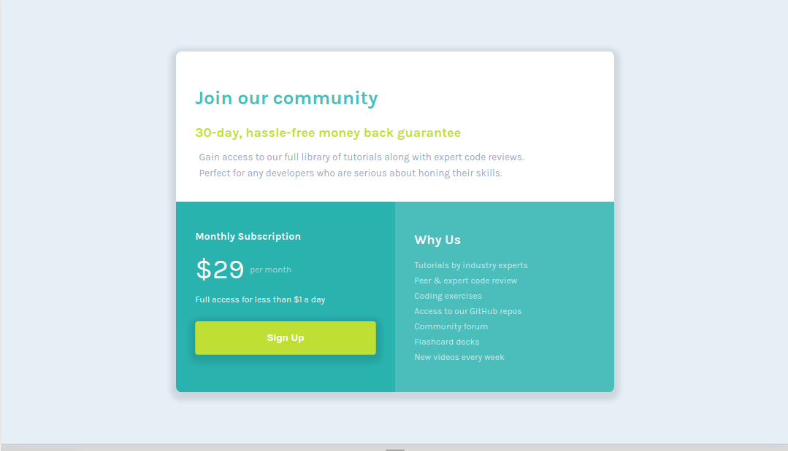

# Frontend Mentor - Single price grid component solution

This is a solution to the [Single price grid component challenge on Frontend Mentor](https://www.frontendmentor.io/challenges/single-price-grid-component-5ce41129d0ff452fec5abbbc). Frontend Mentor challenges help you improve your coding skills by building realistic projects.

## Table of contents

-   [Overview](#overview)
    -   [The challenge](#the-challenge)
    -   [Screenshot](#screenshot)
    -   [Links](#links)
-   [My process](#my-process)
    -   [Built with](#built-with)
    -   [What I learned](#what-i-learned)
    -   [Continued development](#continued-development)
    -   [Useful resources](#useful-resources)
-   [Author](#author)
-   [Acknowledgments](#acknowledgments)

## Overview

### The challenge

Users should be able to:

-   View the optimal layout for the component depending on their device's screen size
-   See a hover state on desktop for the Sign Up call-to-action

### Screenshot

### Links

-   Solution URL: [https://www.frontendmentor.io/solutions/simple-single-price-component-using-flexbox-bV-J2MAQJ](https://www.frontendmentor.io/solutions/simple-single-price-component-using-flexbox-bV-J2MAQJ)
-   Live Site URL: [https://ameyadeokule.github.io/simple-price-table/](https://ameyadeokule.github.io/simple-price-table/)

## My process

### Built with

-   Semantic HTML5 markup
-   CSS custom properties
-   Flexbox

### What I learned

Using Flexbox and arranging the components using flex features. Using media queries along with flex to change element sizes for smaller screens.

### Continued development

I would love to make this design using tailwind or SASS to improve my skills and later convert it to React as a SAP.

### Useful resources

-   [A Complete Guide to Flexbox](https://css-tricks.com/snippets/css/a-guide-to-flexbox/) - This section helped me in better understanding flexbox and how the arrangements world
-   [A Complete Guide to CSS Media Queries](https://css-tricks.com/a-complete-guide-to-css-media-queries/) - This is an amazing article which helped me finally understand breakpoints and how to handle HTML elements on a much smaller screen using CSS media queries.

## Author

-   Name - [Ameya Deokule]
-   Frontend Mentor - [@ameyadeokule](https://www.frontendmentor.io/profile/ameyadeokule)

## Acknowledgments

I would like thank Kethmar Salumets [@developerhabits](https://twitter.com/developerHabits) for encouraging me to start completing challenges on Frontend Mentor.
